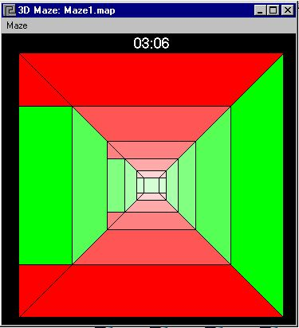



## A Mazing 3D

### Description

This program lets you walk through a 3D Maze, it also has a ton of options including a maze editor! Just have fun with it.
 
### More Info
 

             |
---                |---
**Submitted On**   |2000-02-09 20:16:08
**By**             |[Ryan Condon](https://github.com/Planet-Source-Code/PSCIndex/blob/master/ByAuthor/ryan-condon.md)
**Level**          |Advanced
**User Rating**    |4.6 (23 globes from 5 users)
**Compatibility**  |VB 4\.0 \(32\-bit\), VB 5\.0, VB 6\.0
**Category**       |[Games](https://github.com/Planet-Source-Code/PSCIndex/blob/master/ByCategory/games__1-38.md)
**World**          |[Visual Basic](https://github.com/Planet-Source-Code/PSCIndex/blob/master/ByWorld/visual-basic.md)
**Archive File**   |[CODE\_UPLOAD3321292000\.zip](https://github.com/Planet-Source-Code/ryan-condon-a-mazing-3d__1-5954/archive/master.zip)

